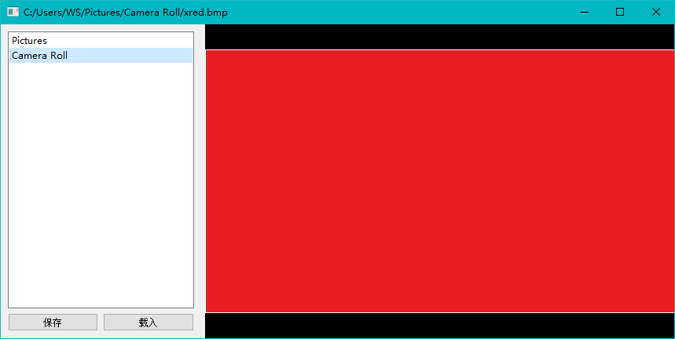
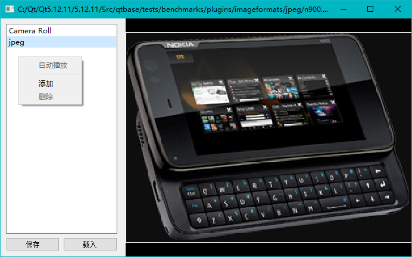
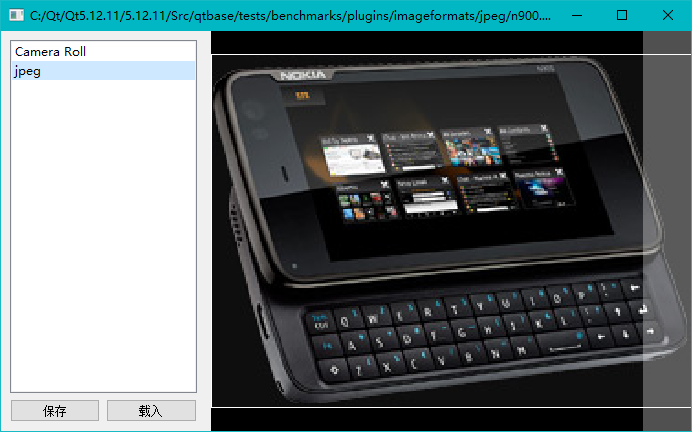

# PicsGalaxy
一个简单的图片播放器

## 界面介绍

软件界面被划分为作用两部分，左侧视图为播放列表显示区域，右侧视图为图片显示区域。

## 操作说明
* 用户可以使用左侧视图的载入按钮，载入用户曾经保存在播放列表；
* 用户可以使用左侧视图的保存按钮，保存当前的播放列表；
* 用户可以使用右键菜单的添加和删除，编辑当前的播放列表；
  
* 用户可以使用右键菜单的自动播放，对当前播放列表内包含的图片，按照名称顺序依次播放；
* 用户可以点击右侧视图的左侧边缘或者右侧边缘，切换当前播放的图片；
  
* 窗口顶部的标题栏显示当前播放的图片的路径；